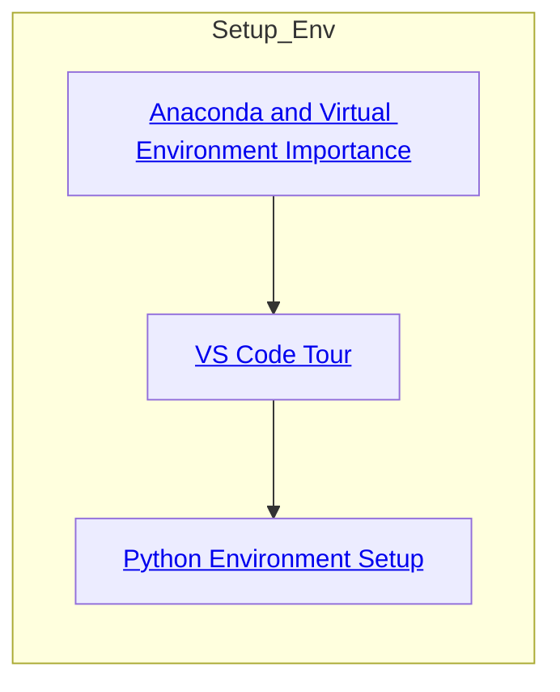
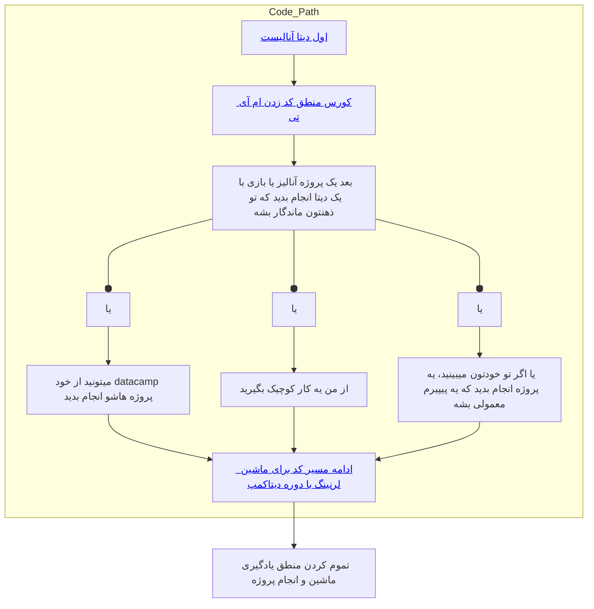
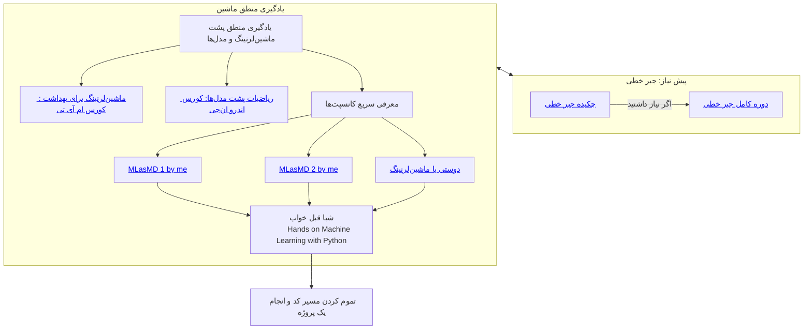

# ورژن 3.2 مسیر یادگیری کد زدن برای افرادی با بک گراند پزشکی :)
سلام ، اینجا من براتون کلیات مسیری که باید برید رو گذاشتم. دوره های خیلی زیادی هست و هر کدوم رو که دیدید، فرقی نداره، مهم اینه که این چیزایی که نوشته شده رو یادبگیرید و برید مرحله بعدی.
### 1: نصب پایتون و آناکندا و یادگرفتن اینکه ویرچوال اینوایرمنت چیه و جایی که توش کد میزنید یعنی وی اس کد

### 2: سقوط آزاد در کد زدن

### 3: منطق یادگیری ماشین

