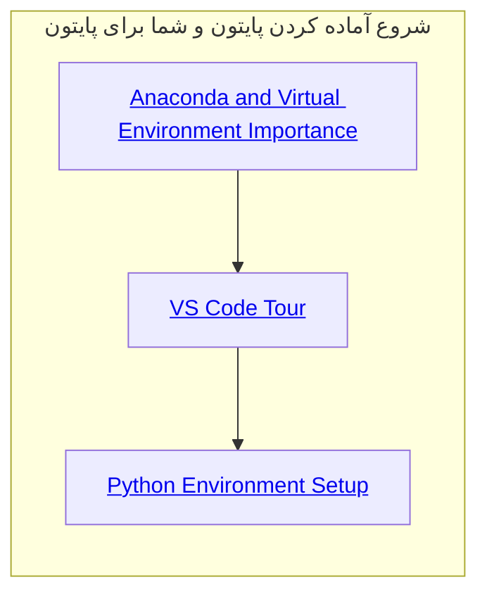
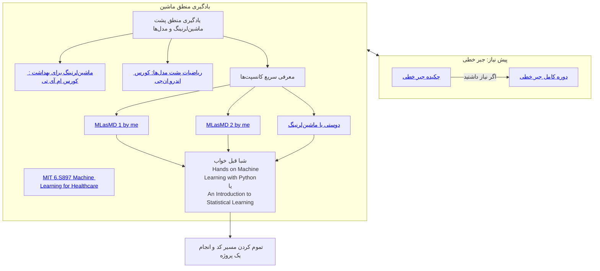
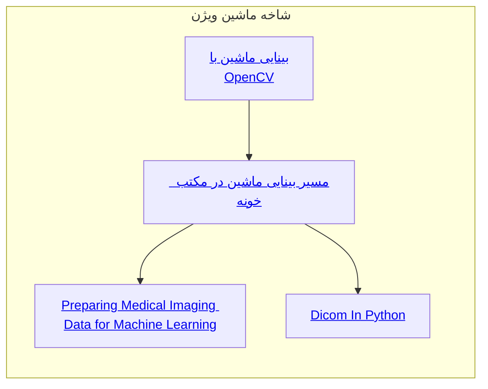
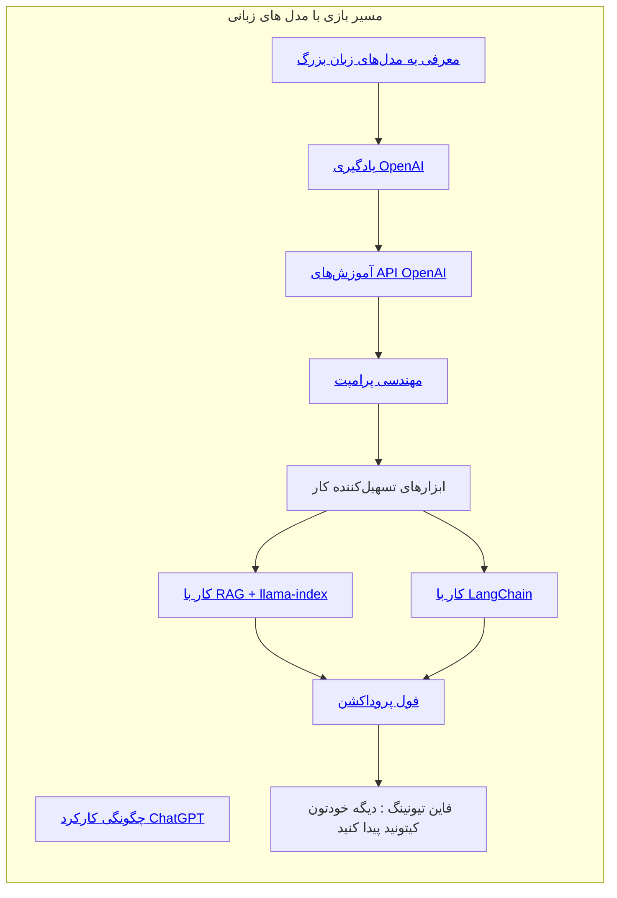

<div dir="rtl" style="text-align: right">
    
# ورژن 3.2 مسیر یادگیری کد زدن برای افرادی با بک گراند پزشکی :)
    
سلام ، اینجا من براتون کلیات مسیری که باید برید رو گذاشتم. دوره های خیلی زیادی هست و هر کدوم رو که دیدید، فرقی نداره، مهم اینه که این چیزایی که نوشته شده رو یادبگیرید و برید مرحله بعدی. 

    آپدیت: لطفا دوره های خیلی خوبه مکبت خونه توسط دانشگاه شریف رو ببینید. من هنوز ادشون نکردم و توی پایین این صفحه میتونید پیداشون کنید. 
    واقعا با دیدن این ویدیو ها کل مسیر رو میتونید برید.

    آپدیت خیلی جدید: به جای کل این صفحه میتونید این کورس رو ببینید: https://www.deeplearning.ai/courses/machine-learning-specialization/

### 1: نصب پایتون و آناکندا و یادگرفتن اینکه ویرچوال اینوایرمنت چیه و جایی که توش کد میزنید یعنی وی اس کد



### 2: سقوط آزاد در کد زدن
Here are your hyperlinks formatted in Markdown:

اول دیتا آنالیست ([Data Analyst with Python](https://www.datacamp.com/tracks/data-analyst-with-python)) + در حین این پروژه بهتره کورس منطق کد زدن ([MIT course](https://www.youtube.com/playlist?list=PLUl4u3cNGP63WbdFxL8giv4yhgdMGaZNA)) هم ببینید بعد یک پروژه آنالیز یا بازی با یک دیتا انجام بدید که تو ذهنتون ماندگار بشه. میتونید از خود datacamp پروژه هاشو انجام بدید ، از من یه کار کوچیم بگیرید. یا اگر تو خودتون میبینید، یه پروژه انجام بدید که یه پیپیرم معمولی بشه.


### 3: منطق یادگیری ماشین
 ادامه مسیر کد برای ماشین لرنینگ: بعد ماشین لرنینگ ([Machine Learning Scientist with Python](https://www.datacamp.com/tracks/machine-learning-scientist-with-python)) ببینید و بعد هم باز یه پروژه ML کوچیک انجام بدید. کلی دیتای آنلاین وجود داره که میشه باهاش کارای خفن کرد. بگردید. یک پیش نیازی داره یادگرفتن این ML و مدل ها اون جبر خطی هست. من این دوتارو پیدا کردم ولی خب هر چی دیدید اوکیه. [Essence of linear algebra](https://www.youtube.com/playlist?list=PLZHQObOWTQDPD3MizzM2xVFitgF8hE_ab), [Linear Algebra - Full College Course](https://www.youtube.com/watch?v=JnTa9XtvmfI), کورس  Machine Learning for Healthcare MIT ([Machine Learning for Healthcare](https://www.youtube.com/playlist?list=PLUl4u3cNGP60B0PQXVQyGNdCyCTDU1Q5j)) این کمتر ریاضیه، کورس ریاضی پشت مدل ها  Stanford:  Andrew NG ([Andrew NG's course](https://youtube.com/playlist?list=PLoROMvodv4rMiGQp3WXShtMGgzqpfVfbU&si=uqVtGLVlx0QjYVHW)) این ریاضیه ولی حداقل چیزیه که باید بدونید. اگر جایی رو نفهمدید اوکیه.

یه سری ویدیو که زود میتونه کل موضوع ها رو بگه (برای روزای اول خوبه که سریع با کانسپتا آشنا بشید:
2 تا ویدیو از دوره ای که من گفتم به نام MLasMD  پارت 1 ([MLasMD Part 1](https://youtu.be/o0tXqGfKFf4)) و پارت 2, 4 تا ویدیو making friends with Machine Learning (MFML) ([MFML series](https://youtube.com/playlist?list=PLRKtJ4IpxJpB_2ei8-5eWU31EZ6uSj9_s&si=550kUZ8RAIROjCCW))که کلا میتونید اصلا این رو به عنوان اولین کور ببینید و خیلی ویدیو خوبی هست این هم.

از اینجا به بعد خودتون میتونید یاد بگیرید. یعنی باید تو این مسیر با این سر نخا بتونید یادبگیرید که تنهایی یادبگیرید. هر چی دیدی خوبه و اصولا دیگه باید تو پروژه برید یاد بگیرید. ولی خب از اینجای خیلی چند شاخه میشه و فیلد به فیلد متفاوته و تخصصیه. من  2 شاخه ماشین ویژن و LLM رو یکم مینویسم. (دو شاخه ی Deep learning و داینامیک مدل ها که با سری زمانی کار میکنن رو هم بعدا اضافه میکنم)



### شاخه ویژن: 
من ویژن رو با انجام پروژه یاد گرفتم واسه همین خیلی سورس خاصی نمیدونم بگم. میدونم یه سری کتاب خیلی خوب هست. ولی این بینایی ماشین با OpenCV ([Machine Vision with OpenCV](https://maktabkhooneh.org/course/%D8%A2%D9%85%D9%88%D8%B2%D8%B4-%D9%BE%D8%B1%D8%AF%D8%A7%D8%B2%D8%B4-%D8%AA%D8%B5%D9%88%DB%8C%D8%B1-%D8%A8%DB%8C%D8%AF%D8%A7%DB%8C%DB%8C-%D9%85%D8%A7%D8%B4%DB%8C%D9%86-opencv-mk1664/)) تو مکتب خونه خوب بود و الزامی. الان دیدم یک مسیر بینایی ماشین ([Machine Vision Path](https://maktabkhooneh.org/career/%D8%AA%D8%AE%D8%B5%D8%B5-%D8%A8%DB%8C%D9%86%D8%A7%DB%8C%DB%8C-%D9%85%D8%A7%D8%B4%DB%8C%D9%86-mk42/)) هم داره که به نظرم منطقی میاد که از صفر تا صد برید تو ویژن خیلیییی کامله.

اینارو هم حتما ببینید:
[Preparing medical imaging data for machine learning](https://www.youtube.com/watch?v=9Ga9pn9M-MQ)
[Dicom In Python](https://www.youtube.com/watch?v=To7v7i7eB0A&t=1191s)



### شاخه Large Language Model (LLM): 

بعد از یادگرفتن کد (مسیر کد) میتونید حتی بدون دیدن ماشین لرنینگ (یعنی فقط ا دیتا آنالیست ([Data Analyst with Python](https://www.datacamp.com/tracks/data-analyst-with-python)) + کورس منطق کد زدن ([Coding Logic course](https://www.youtube.com/playlist?list=PLUl4u3cNGP63WbdFxL8giv4yhgdMGaZNA))) میتونید شروع کنید به LLM بازی. میگم بازی چون اونقدر عمیق نیست اینا ، برای عمیق شدن توی LLM نزدیک 1 سال زمان میبره و فیلد گنده و سختیه. بهتره این ویدیوهای کوتاه رو ببینید که یک ایده کلی داشته باشید از کانسپتاش: 
[How ChatGPT Works Technically](https://www.youtube.com/watch?v=bSvTVREwSNw),
[1hr Talk] Intro to Large Language Models ([Intro to LLMs](https://www.youtube.com/watch?v=zjkBMFhNj_g)).

اول از همه که خود openai رو یاد بگیرید با این ویدیو ([Learn OpenAI](https://www.youtube.com/watch?v=pGOyw_M1mNE)) یه هر چیز دیگه تو یوتیوب پیدا کردید. همیشه لازم و اغلب کافیه. برای اینکه چیزای دیگه رو یادبگیرید که چجوری میشه از این استفاده کرد این لیست رو ببینید OpenAI API Tutorials ([API Tutorials](https://youtube.com/playlist?list=PLpdmBGJ6ELUIYHjmzYTuePlNRf7yeCACz&si=AmEna2NY_Ckzl5KD)). یادتون نره prompt خیلی مهمه و این ویدیو prompt enginerring ([Prompt Engineering](https://www.youtube.com/watch?v=_ZvnD73m40o&pp=ygUfaW50cm9kdWN0aW9uIHRvIGxsbSBhbmQgY2hhdGdweQ%3D%3D)) خوبه.

دو تای ماژول هستن که میان کار رو راحت میکنن ، پیشنهاد من LangChain هست. جفتشون مشابه هم هستن. 
برای کار با LangChain ([LangChain playlist](https://www.youtube.com/playlist?list=PL8motc6AQftn-X1HkaGG9KjmKtWImCKJS))
یا
برای کار با RAG + llama-index ([RAG + llama-index playlist](https://youtube.com/playlist?list=PLVEEucA9MYhNrD8TBI5UqM6WHPUlVv89w&si=0VD5DzeTZ0ztxcWa)).

بعدش برای فول پروداکشن ([Full Production](https://www.youtube.com/watch?v=dXxQ0LR-3Hg&pp=ygULbGxhbWEgaW5kZXg%3D)) میتونید این رو ببیینید و همزمان برای یه کاری که دوست دارید اپ درست کنید یا کد بزنید.

از اینجا برید جلو تر باید fine-tune کردن و training این LLM هارو یادبگیرید و hugginface.




### شاخه Deep Learning خفن:
loading... (dorost mikonam badan)

### شاخه Multi-Task Learning: 
loading... (dorost mikonam badan)

### شاخه مدل های زمانی:
loading... (dorost mikonam badan)

### اکانت هایی که تو این مسیر باید بخرید
اکانت چت جی پی تی از [نامبر لند](https://numberland.ir/account/openai) برای پرسیدن سوالاتون و کمک گرفتن تو یادگیری (3.5 کافیه ولی اگر کار زیاد دارید 4 میارزه 2 تومن)

اکانت وی پی انی v2ray از [نت شکن](https://nshekan.com/)

اکانت دیتاکمپ از [لایسنس مارکت ](https://license-market.ir/product/DataCamp) (واقعا نمیدونم میارزه اکانت روی ایمیل خودتون یا نه :)
</div>

_______________ 
```
[Last Update: 2024-07-01]
# Note for me:
On the next update add these materials:
```

<detail

### دوره هایی که توی ورژن بعدی باید ادد کنم
- ویدیو های حسین روی مولتی تسک و دیپ لرنینگ
- دوره مکتب خونه [آموزش رایگان هوش مصنوعی توسط استاد رهبان گرامی](https://maktabkhooneh.org/course/%D8%A2%D9%85%D9%88%D8%B2%D8%B4-%D8%B1%D8%A7%DB%8C%DA%AF%D8%A7%D9%86-%D9%87%D9%88%D8%B4-%D9%85%D8%B5%D9%86%D9%88%D8%B9%DB%8C-mk2867/) 
- - دوره مکتب خونه [آموزش رایگان یادگیری ماشین برای بیوانفورماتیک توسط استاد شریفی عزیز](https://maktabkhooneh.org/course/%D8%A2%D9%85%D9%88%D8%B2%D8%B4-%D8%B1%D8%A7%DB%8C%DA%AF%D8%A7%D9%86-%DB%8C%D8%A7%D8%AF%DA%AF%DB%8C%D8%B1%DB%8C-%D9%85%D8%A7%D8%B4%DB%8C%D9%86-%D8%A8%DB%8C%D9%88%D8%A7%D9%86%D9%81%D9%88%D8%B1%D9%85%D8%A7%D8%AA%DB%8C%DA%A9-mk663/#chapter)
  - دوره مکتب خونه [یادگیری ماشین به صورت عملی در علوم پزشکی](https://maktabkhooneh.org/course/%DA%A9%D8%A7%D8%B1%D8%A8%D8%B1%D8%AF-%DB%8C%D8%A7%D8%AF%DA%AF%DB%8C%D8%B1%DB%8C-%D9%85%D8%A7%D8%B4%DB%8C%D9%86-%D8%B9%D9%84%D9%85-%D9%BE%D8%B2%D8%B4%DA%A9%DB%8C-mk1627/#chapter)
  - دوره مکتب خونه آموزش [رایگان تحلیل تصویر پزشکی بازم توسط استاد رهبان](https://maktabkhooneh.org/course/%D8%A2%D9%85%D9%88%D8%B2%D8%B4-%D8%B1%D8%A7%DB%8C%DA%AF%D8%A7%D9%86-%D8%AA%D8%AD%D9%84%DB%8C%D9%84-%D9%87%D9%88%D8%B4%D9%85%D9%86%D8%AF-%D8%AA%D8%B5%D8%A7%D9%88%DB%8C%D8%B1-%D8%B2%DB%8C%D8%B3%D8%AA-%D9%BE%D8%B2%D8%B4%DA%A9%DB%8C-mk1070/) که از خفنای ماشین ویژن هستن
  - دوره مکتب خونه [آموزش رایگان یادگیری تقویتی](https://maktabkhooneh.org/course/%D8%A2%D9%85%D9%88%D8%B2%D8%B4-%D8%B1%D8%A7%DB%8C%DA%AF%D8%A7%D9%86-%DB%8C%D8%A7%D8%AF%DA%AF%DB%8C%D8%B1%DB%8C-%D8%AA%D9%82%D9%88%DB%8C%D8%AA%DB%8C-mk3046/)
 
Storage of good stuff about LLMs
<details>
  <summary>LLMs</summary>
    
  <details>
  <summary>Start</summary>
      - [Langchain playlist ](https://www.youtube.com/playlist?list=PL4HikwTaYE0GEs7lvlYJQcvKhq0QZGRVn)
  </details>

  <details>
  <summary>Structured Output</summary>
      - [w Pydantic](https://youtu.be/UVn2NroKQCw?si=fJArCi6DxE6bY5FR)
      
  </details>
    
  <details>
  <summary>evaluation</summary>
      - https://www.youtube.com/watch?v=iQl03pQlYWY&list=PLkm_s7m1D-JjHBuIGOJQTnAlLNRM-0Dh0&index=1
      - https://www.youtube.com/watch?v=tFXm5ijih98&t=861s
      - https://www.youtube.com/watch?v=8qRGP2hhnSc
      - [Langsmith](https://youtu.be/tFXm5ijih98?si=Q7iqiMHChrOmmL4t)
  </details>


    <details>
  <summary>In-context learning (fine-tune)</summary>
      - [Llama3](https://youtu.be/aQmoog_s8HE?si=H1VpwBKhfZ5o90qt)
      - [BERT](https://www.youtube.com/watch?v=9he4XKqqzvE)
  </details>
  
</details>

